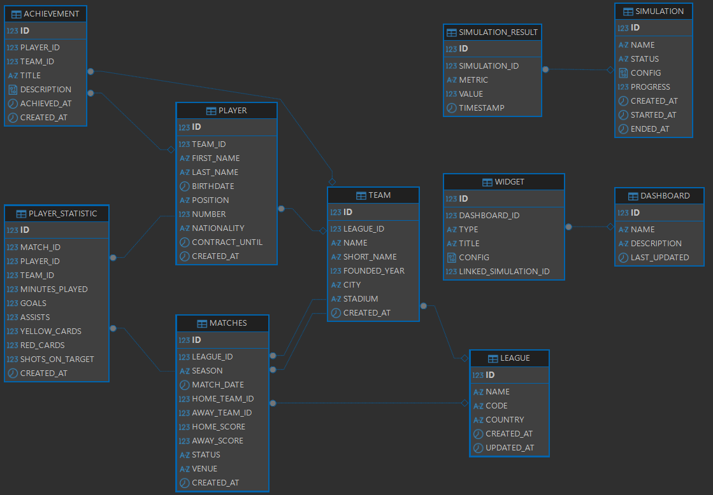

# Spring-GraphQL

[Documentation fonctionnelle](docs/DOCUMENTATION_FONCTIONNELLE.md)

# Démarrage rapide

## Compilation

### Backend

- Compilation

```sh
cd back
mvn clean install
```

- Execution

```sh
mvn spring-boot:run
```

### Frontend

- Compilation

```sh
cd front
npm install
```

- Execution

```sh
ng serve
```

# 🚀 Projet : Retro-League Manager

## 📝 Concept

**Retro-League Manager** est une plateforme de gestion et de simulation de tournois d'e-sport "vintage". Le projet détourne des technologies robustes de type "entreprise" pour créer un univers ludique où les utilisateurs gèrent des ligues, suivent des statistiques de joueurs en temps réel et simulent des matchs via un moteur d'événements aléatoires.

---

## 🛠 Stack Technique

| Composant          | Technologie                 | Rôle                                                                 |
| :----------------- | :-------------------------- | :------------------------------------------------------------------- |
| **Langage** | **Java 24** | Utilisation des *Virtual Threads* et du *Structured Concurrency*.    |
| **Framework Pro** | **Spring Boot 4.0.5** | Socle de l'application (Spring Data, Spring GraphQL).                |
| **Base de Données**| **SQL DB2** | Gestion transactionnelle des scores, paris et classements.           |
| **API** | **Spring GraphQL** | Interface flexible pour consommer uniquement les stats nécessaires.  |
| **Frontend** | **Angular 21** | Interface réactive utilisant les *Signals* pour les scores en direct.|

---

## 🌟 Points Forts & Originalité

### 1. Performance "Next-Gen" avec Java 24

Grâce aux **Virtual Threads**, le serveur peut simuler des milliers de matchs simultanément sans consommer de ressources excessives. Le **Structured Concurrency** permet de gérer les événements de jeu (bonus, malus, scores) de manière isolée et sécurisée.

### 2. Flexibilité GraphQL

Plutôt que des endpoints REST rigides, GraphQL permet au frontend Angular de demander exactement les données souhaitées (ex: uniquement le ratio victoire/défaite pour un mobile, mais l'historique complet pour un desktop).

### 3. La Robustesse de DB2 au service du Fun

Utilisation de la puissance d'IBM DB2 pour exécuter des requêtes analytiques complexes (Window Functions) afin de calculer des classements mondiaux en temps réel et de garantir l'intégrité des données de la ligue.

---

## 🎮 Fonctionnalités Clés

- **Tableau de Bord "Arcade" :** Une interface Angular au look rétro-futuriste.
- **Chaos Engine :** Un service backend qui injecte des imprévus durant les matchs (ex: "Panne de manette", "Bonus de vitesse").
- **Live Subscriptions :** Mise à jour en temps réel des scores via les *Subscriptions* GraphQL.
- **Système de Succès :** Badges débloqués via des procédures stockées ou des requêtes SQL complexes.

---

# IBM DB2

Utiliser l'extension vscode IBM Db2 Developer Extension

## Lignes de commandes (Toujours être en administrateur)

- initialiser l'environnement Db2, à l'initialisation

```cmd
cd C:\Program Files\IBM\SQLLIB\BIN
db2setcp.bat
db2 UPDATE DBM CFG USING SVCENAME 50000
db2set DB2COMM=TCPIP
```

- Vérification installation

```cmd
netstat -an | findstr 50000
db2 GET DBM CFG
```

| Fichier | Rôle |
|---|---|
| `db2clpsetcp.bat` | Initialise les variables d'environnement Db2 |
| `db2cmd.exe` | Lance le Db2 Command Window |
| `db2cmdadmin.exe` | Lance le Db2 Command Window en administrateur |
| `db2clp.bat` | Démarre le Command Line Processor |

- Creation d'une base de données (apres avoir fais db2cmdadmin.exe) :

```cmd
db2 CREATE DATABASE graphql USING CODESET UTF-8 TERRITORY FR PAGESIZE 8192
```

- Se connecter à la base de données (apres avoir fais db2cmdadmin.exe) :

```cmd
db2 CONNECT TO graphql USER db2admin USING root
```

Résumé des commandes DB2 les plus courantes à utiliser depuis la DB2 Command Window (Windows) ou un shell DB2.

| Commande | But | Exemple | Remarques |
|---|---:|---|---|
| `db2cmd.exe` / `db2cmdadmin.exe` | Ouvrir la DB2 Command Window (admin si besoin) | `db2cmdadmin.exe` | Ouvrir en Admin pour opérations SYSADM |
| `db2clp.bat` / initialisation | Initialiser l'environnement DB2 | `cd "C:\Program Files\IBM\SQLLIB\BIN"`<br>`db2clp.bat` | Sinon utiliser `db2cmdadmin.exe` |
| `db2 connect to <DB>` | Se connecter en tant qu'utilisateur OS courant | `db2 connect to graphql` | Utiliser si l'utilisateur Windows a les droits nécessaires |
| `db2 connect to <DB> user <USER> using '<PWD>'` | Se connecter à une base avec identifiants SQL | `db2 connect to graphql user db2admin using 'root'` | Entourer le mot de passe de quotes sur Windows |
| `db2 connect reset` | Déconnecter la session | `db2 connect reset` | Toujours déconnecter après opérations sensibles |
| `db2 -tvf <script.sql>` | Exécuter un script SQL depuis un fichier | `db2 -tvf back\db\db2_create_tables.sql` | `-t` utilise `;` comme terminator, `-v` affiche les commandes |
| `db2 "<SQL_STATEMENT>"` | Exécuter une instruction SQL inline | `db2 "GRANT DBADM ON DATABASE TO USER DB2ADMIN"` | Entourer l'instruction complète par des quotes |
| `db2 -x "<SELECT ...>"` | Exécuter SELECT et afficher seulement les résultats (sans entête) | `db2 -x "SELECT TABSCHEMA,TABNAME FROM SYSCAT.TABLES"` | Pratique pour parsers/scripts |
| `db2 CREATE DATABASE <name> ...` | Créer une base DB2 (instance locale) | `db2 CREATE DATABASE graphql USING CODESET UTF-8 TERRITORY FR PAGESIZE 8192` | Exécuter depuis `db2cmdadmin` si nécessaire |
| `db2 DROP DATABASE <name>` | Supprimer une base | `db2 DROP DATABASE graphql` | Opération destructive — sauvegarder avant |
| `db2start` / `db2stop` | Démarrer / arrêter l'instance DB2 | `db2start` | Nécessite privilèges système |
| `db2 get dbm cfg` | Afficher la configuration d'instance (DBM CFG) | `db2 get dbm cfg` | Permet lire `SYSADM_GROUP`, `SVCENAME`, etc. |
| `db2 update dbm cfg using SVCENAME <port>` | Modifier le port/service de l'instance | `db2 update dbm cfg using SVCENAME 50000` | Nécessite redémarrage instance |
| `db2set DB2COMM=TCPIP` | Configurer la méthode de communication | `db2set DB2COMM=TCPIP` | Puis redémarrer l'instance si modifié |
| `db2 catalog tcpip node <node> remote <host> server <port>` | Cataloguer un noeud distant | `db2 catalog tcpip node N1 remote dbhost server 50000` | Pour accès réseau entre clients/serveurs |
| `db2 catalog database <db> as <alias> at node <node>` | Cataloguer une DB distante sous alias | `db2 catalog database GRAPHQL as graphql at node N1` | Suivi de `db2 list db directory` |
| `db2 "CREATE SCHEMA <schema> AUTHORIZATION <user>"` | Créer un schéma et définir un propriétaire | `db2 "CREATE SCHEMA GRAPHQL AUTHORIZATION DB2ADMIN"` | Utile si DB2ADMIN doit posséder le schéma |
| `db2 "GRANT CREATEIN ON SCHEMA <schema> TO USER <user>"` | Accorder le droit de création dans un schéma | `db2 "GRANT CREATEIN ON SCHEMA GRAPHQL TO USER DB2ADMIN"` | Alternative plus restrictive que DBADM |
| `db2 "GRANT DBADM ON DATABASE TO USER <user>"` / `REVOKE` | Accorder / révoquer l'autorité DBADM | `db2 "GRANT DBADM ON DATABASE TO USER DB2ADMIN"` | Très puissant — utiliser avec prudence |
| `db2 -x "SELECT * FROM SYSCAT.DBAUTH WHERE GRANTEE='<user>'"` | Vérifier privilèges DB pour un utilisateur | `db2 -x "SELECT * FROM SYSCAT.DBAUTH WHERE GRANTEE='DB2ADMIN'"` | Les colonnes peuvent varier selon version |



# Spring

## Conversion Entité-DTO: Recommandations Spring

La recommandation architecturale standard dans l'écosystème Spring est de situer la conversion dans la couche Service.

- Le **Controller** reçoit un DTO et le passe au Service.
- Le **Service** transforme le DTO en Entité pour travailler avec le Repository, et transforme l'Entité sortante en DTO avant de la renvoyer au Controller.
- Cela permet de garder les Controllers "fins" et de s'assurer que la logique métier ne manipule que des objets cohérents.

Exemple:

- Dépendances

```xml
<dependencies>
    <dependency>
        <groupId>org.mapstruct</groupId>
        <artifactId>mapstruct</artifactId>
        <version>1.5.5.Final</version>
    </dependency>
</dependencies>

<build>
    <plugins>
        <plugin>
            <groupId>org.apache.maven.plugins</groupId>
            <artifactId>maven-compiler-plugin</artifactId>
            <version>3.11.0</version>
            <configuration>
                <annotationProcessorPaths>
                    <path>
                        <groupId>org.mapstruct</groupId>
                        <artifactId>mapstruct-processor</artifactId>
                        <version>1.5.5.Final</version>
                    </path>
                    <path>
                        <groupId>org.projectlombok</groupId>
                        <artifactId>lombok</artifactId>
                        <version>1.18.30</version>
                    </path>
                    <path>
                        <groupId>org.projectlombok</groupId>
                        <artifactId>lombok-mapstruct-binding</artifactId>
                        <version>0.2.0</version>
                    </path>
                </annotationProcessorPaths>
            </configuration>
        </plugin>
    </plugins>
</build>
```

- Création du Mapper

L'élément clé est l'attribut `componentModel = "spring"`. Cela permet à MapStruct de générer une classe annotée avec `@Component`, vous permettant de l'injecter via `@Autowired` ou par constructeur.

Exemple :

```java
import org.mapstruct.Mapper;
import org.mapstruct.Mapping;

@Mapper(componentModel = "spring")
public interface UserMapper {

    // Si les noms de champs sont identiques, MapStruct les mappe automatiquement
    UserDto toDto(User user);

    // Si les noms diffèrent, utilisez l'annotation @Mapping
    @Mapping(target = "password", ignore = true) // Sécurité : on n'expose jamais le mot de passe
    User toEntity(UserDto userDto);
}
```

- Utilisation dans la couche Service

Une fois le mapper défini, son utilisation est transparente dans vos services Spring.

Exemple :

```java
@Service
@RequiredArgsConstructor // Lombok pour l'injection par constructeur
public class UserService {

    private final UserRepository userRepository;
    private final UserMapper userMapper;

    public UserDto getUserById(Long id) {
        User user = userRepository.findById(id)
                .orElseThrow(() -> new EntityNotFoundException("Utilisateur non trouvé"));
        
        // Conversion propre via MapStruct
        return userMapper.toDto(user);
    }
}
```

# Spring-GraphQL

## Création des fichiers .graphqls

1. Son rôle principal : Définir le contrat
Dans l'écosystème GraphQL, l'extension .graphqls est spécifiquement utilisée pour définir le Schema Definition Language (SDL).
C'est le fichier "architecte" de votre API : il décrit la structure des données sans se soucier de la manière dont elles sont récupérées.
Le fichier .graphqls sert à déclarer ce que votre API est capable de faire. Il contient la définition des types, des requêtes (Queries), des mutations et des abonnements (Subscriptions).

2. Pourquoi le "s" ? (.graphql vs .graphqls)
Bien que les deux soient souvent utilisés de manière interchangeable, il existe une nuance conventionnelle :

- .graphql : Souvent utilisé pour les opérations côté client (les requêtes query { ... } que le front-end envoie au serveur).
- .graphqls : Le "s" signifie Schema. Il est utilisé côté serveur pour définir le schéma global.

Note : De nombreux outils et bibliothèques (comme Apollo ou Spring Boot GraphQL) reconnaissent les deux, mais .graphqls aide les développeurs et les IDE à identifier immédiatement qu'il s'agit de la structure du serveur.

### Implementation

1. Création des `entities` representatives du DSL qraphqls :
    - [type Dashboard](back/src/main/java/ruffinjy/spring_graphql/entities/Dashboard.java)
    - [type Simulation](back/src/main/java/ruffinjy/spring_graphql/entities/Simulation.java)
    - [type SimulationResult](back/src/main/java/ruffinjy/spring_graphql/entities/SimulationResult.java)
    - [SimulationStatus](back/src/main/java/ruffinjy/spring_graphql/entities/SimulationStatus.java)
    - [type Widget](back/src/main/java/ruffinjy/spring_graphql/entities/Widget.java)
    - [enum WidgetType](back/src/main/java/ruffinjy/spring_graphql/entities/WidgetType.java)
2. Création des `repositories` representatives des entities DSL qraphqls :
    - [Dashboard repository](back/src/main/java/ruffinjy/spring_graphql/repositories/DashboardRepository.java)
    - [Simulation repository](back/src/main/java/ruffinjy/spring_graphql/repositories/SimulationRepository.java)
    - [Widget repository](back/src/main/java/ruffinjy/spring_graphql/repositories/WidgetRepository.java)
3. Création des `dtos` representatives des entities DSL qraphqls :
    - [CreateSimulationInputDto](back/src/main/java/ruffinjy/spring_graphql/dtos/CreateSimulationInputDto.java)
    - [ParameterInputDto](back/src/main/java/ruffinjy/spring_graphql/dtos/ParameterInputDto.java)
    - [SimulationConfigInputDto](back/src/main/java/ruffinjy/spring_graphql/dtos/SimulationConfigInputDto.java)
    - [SimulationProgressDto](back/src/main/java/ruffinjy/spring_graphql/dtos/SimulationProgressDto.java)
    - [SimulationSummaryDto](back/src/main/java/ruffinjy/spring_graphql/dtos/SimulationSummaryDto.java)
4. Création des `services` :
    - [SimulationPublisherService](back/src/main/java/ruffinjy/spring_graphql/services/SimulationPublisher.java)
    - [SimulationService](back/src/main/java/ruffinjy/spring_graphql/services/SimulationService.java)
    - [WidgetService](back/src/main/java/ruffinjy/spring_graphql/services/WidgetService.java)
5. Création des `controllers` :
    - [SimulationController](back/src/main/java/ruffinjy/spring_graphql/controllers/SimulationController.java)
6. Création de la configuration graphql
    - [GraphqlConfig](back/src/main/java/ruffinjy/spring_graphql/config/GraphqlConfig.java)
